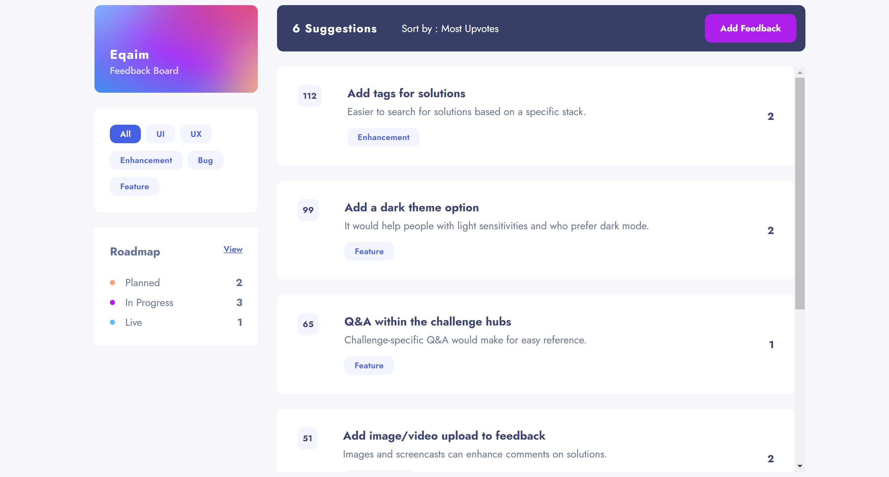

# Eqaim - SASS feedback app solution

## Table of contents

- [Overview](#overview)
  - [The challenge](#the-challenge)
  - [Steps](#steps)

## Overview

### The challenge

Users should be able to:

- View the optimal layout for the app depending on their device's screen size
- See hover states for all interactive elements on the page
- Create, read, update, and delete SASS feedback requests
- Receive form validations when trying to create/edit feedback requests
- Sort suggestions by most/least upvotes and most/least comments
- Filter suggestions by category
- Add comments and replies to a SASS feedback request
- Upvote SASS feedback requests
- Keep track of any changes, even after refreshing the browser (`localStorage` could be used for this if you're not building out a full-stack app)

### Steps
- run the setup.sh file
- create .env file for both server and web using .env.example as template
- run the start.server.sh and start.web.sh file using bash

